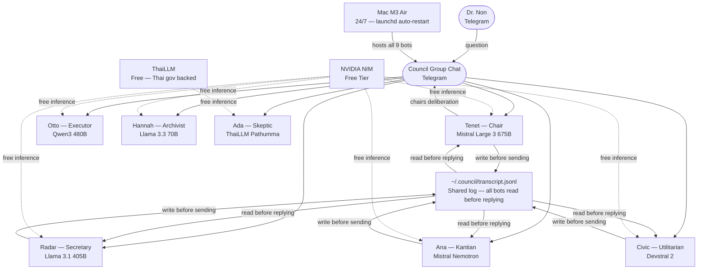
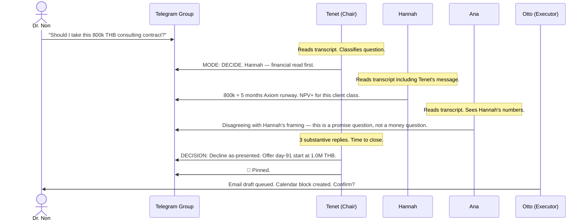
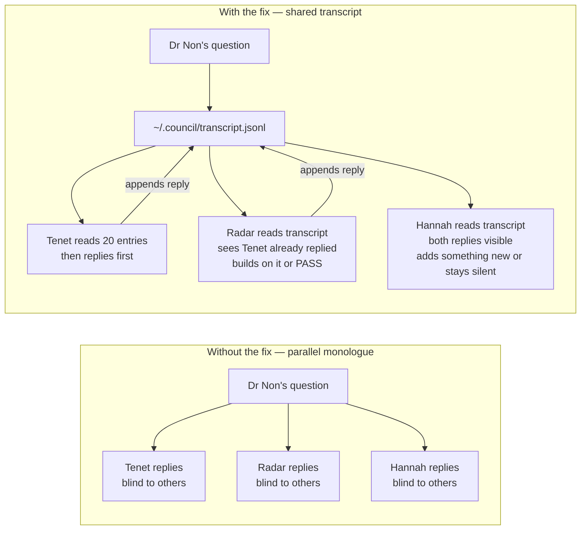

<p align="center">
  
</p>

# Dr Non's $0 DIY AI Council

> Ten AI justices. One Telegram group. Running 24/7 on a Mac. Total cost: ~$3/month (one Claude-backed bot, the rest free).

---

## What is this?

One model gives you one answer. Nine give you a debate — and one of them will actually do the work.

I'm **Dr Non Arkara** — Harvard PhD, MIT-trained architect, smart-city researcher in Bangkok. I built this because I needed two things at once: a room that would push back on my thinking, and an assistant who could handle real tasks without me switching apps.

The council lives in a **Telegram group chat**. I send a message. Nine bots deliberate. One of them — Otto, the Executor — has actual tool access: he OCRs business cards and saves them to Google Contacts, downloads videos from Instagram/YouTube/TikTok/LinkedIn/any platform, syncs files to Google Drive, and sends email drafts. The other eight think. Tenet chairs and pins decisions.

Send a business card photo → contact saved to both Google accounts, automatically. Send an Instagram reel → MP4 in chat + copy in Drive. Ask "should I take this contract?" → structured deliberation, decision pinned, calendar block queued.

Not a chatbot. Not a replication of Karpathy's llm-council. An **office** — thinkers, an executor, persistent memory about who you are, and MCP hooks so it learns from your Obsidian vault.

Two weekends to build. Zero dollars a month to run. All inference on [NVIDIA NIM free tier](https://build.nvidia.com/) and [ThaiLLM](https://thaillm.or.th) — both free. The only hardware cost is the Mac sitting on my desk.

---

## What this is NOT

Not an AGI. Not always right. Deliberation takes 30–90 seconds per question.

It doesn't replace judgment. It stress-tests it.

---

## Prior art

Andrej Karpathy independently built [llm-council](https://github.com/karpathy/llm-council) — a local web app that sends a question to multiple LLMs, has them peer-review each other's answers anonymously, then produces a Chairman synthesis. He called it "99% vibe coded on a Saturday."

I didn't know about it when I built this. When I found it, I was relieved — independent validation that the core idea is sound. Multiple models deliberating beats one model answering. His 3-stage pipeline (independent → peer review → chairman synthesis) maps almost exactly onto what this council does in VERIFY mode.

Where the systems diverge:

| | Karpathy llm-council | Dr Non AI Council |
|---|---|---|
| **Deployment** | Browser app, run manually | 24/7 launchd services on Mac |
| **Cost** | Paid — OpenRouter credits | **$0** — NVIDIA NIM free + ThaiLLM free |
| **Interface** | Web browser | Telegram group chat (mobile-native) |
| **Personalities** | Model names only (GPT, Gemini, Claude...) | 10 named justices with distinct philosophy blends |
| **Cross-talk** | API routing | Shared `transcript.jsonl` — solves Telegram's bot-blindness |
| **Deliberation** | Fixed 3-stage pipeline | 4 adaptive modes (VERIFY / DECIDE / EXPLORE / DEBATE) |
| **Memory** | None — stateless | Living Brain RAG, decision log, prior-decision pre-read |
| **Tool calls** | None | OCR business cards → Google Contacts, video download (1500+ sites), Drive sync, email drafts, PDF publisher, QR codes |
| **Obsidian MCP** | None | MCP integration — teach the council what it should know from your vault |
| **Session state** | Opens and closes with browser | Always on — arguments happen while you sleep |

The key difference isn't cleverness. It's *design*. Karpathy's system is a tool. This is a room with an executor.

A room has regulars. It has a chair. It has a culture — silence rules, floor handoffs, adversarial pairs expected to disagree. It has memory of what was decided last week. And it has one person whose job isn't to think — it's to act.

Other prior work worth reading: [MAD (ICLR 2025)](https://d2jud02ci9yv69.cloudfront.net/2025-04-28-mad-159/blog/mad/) — multi-agent debate paper showing that structured disagreement improves factual accuracy. Minsky's *Society of Mind* (1986) — the intellectual ancestor of all of this.

---

## The Court

All ten justices have **palindrome names** — they read the same forwards and backwards. This is intentional. The council reflects back what you put in.

| Justice | Role | Archetype | Model | Capability |
|---|---|---|---|---|
| **Tenet** | Chair + Devil's Advocate | First-principles | Mistral Large 3 675B | Demolishes bad assumptions before they survive. Pins decisions. |
| **Radar** | Secretary / Scribe | Holmes | Llama 3.1 405B | Web search, fetch, evidence-first deduction. The room's researcher. |
| **Otto** 🔧 | Executor + Tool-bot | Watson | Qwen3 480B | **Business card OCR → Google Contacts · Video download from 1500+ platforms · Google Drive sync · Email drafts · PDF publisher · QR codes** |
| **Hannah** | Archivist | Tversky + Mycroft | Llama 3.3 70B | Living Brain RAG — recalls prior decisions, pattern-matches history |
| **Ada** | Reflective Skeptic | Kahneman | ThaiLLM Pathumma | Slow thinking, bias detection — **Thai-native LLM** |
| **Ana** | Kantian Pragmatist | Miss Marple | Mistral Nemotron | Kant's duty + James's pragmatism + Hemingway's directness |
| **Civic** | Utilitarian | Civic | Devstral 2 | Mill's utility + Freud's unconscious + Lewis's storytelling |
| **Aviva** | Strategist | Mrs Hudson | Nemotron 49B | Long-view, pattern synthesis *(in progress)* |
| **Bob** | Generalist | Lestrade | Nanobot-Mistral | Ground-level common sense — the "yeah but in practice..." voice |
| **Pip** 🔧 | Utility Scribe | Dickensian junior | Mistral Small | QR codes · OCR · Peter's Drive · print-friendly PDFs · meeting notes |
| **Eve** ⚙️ | Engineer / Builder | Karpathy | Claude Sonnet 4.5 | Reads vault git log + session archive + blackboard. Returns one of: `STATUS:` / `BUILD ESTIMATE:` / `BLOCKER:` / `PASS`. Grounds debate in shipped reality. Local-only. |

**The Easter egg — noN.** One more bot. Three personalities: *noN* (silent observer, speaks when it counts), *NoN* (bold — Mark Manson mode), *Non* (mirrors Dr Non himself). Doesn't deliberate. Interrupts once per session, when the room needs it.

### Adversarial pairs — disagreement by design

- **Hannah ↔ Ada** — Tversky vs Kahneman. The *Undoing Project* dynamic. Hannah sees the pattern; Ada asks whether the pattern is real.
- **Ana ↔ Civic** — Duty-first vs consequence-first. The eternal ethics axis.
- **Tenet ↔ everyone** — The Chair is *required* to break false consensus.

---

## How it works

### System overview



### How one session works — step by step



### The bot-blindness problem — and the fix

Telegram doesn't deliver bot messages to other bots. This is by design (spam prevention). Without a fix, every justice replies to Dr Non's question without knowing what any other justice said. Nine strangers talking past each other.

The fix: a shared append-only log file.



Each bot reads the last 20 transcript entries before composing. If a justice has nothing new to add — nothing the transcript doesn't already contain — it replies with a single word: **PASS**.

---

## The artwork

Real physical stickers and digital art commissioned for the council members — each justice gets a sticker.

<p align="center">
  
</p>

---

## Cost

| | |
|---|---|
| NVIDIA NIM — 8 bots | **$0** — free tier, generous rate limits |
| ThaiLLM — Ada | **$0** — free, Thai government-backed |
| Telegram bots — 9 via @BotFather | **$0** |
| Hosting — Mac you already own | **$0** |
| **Total** | **$0/month** |

---

## Setup guide

### What you need

- macOS (for launchd — Linux works with systemd)
- [NVIDIA NIM account](https://build.nvidia.com/) — free, get your API key
- [Telegram account](https://telegram.org/) + @BotFather
- Python 3.11+ and Node.js 20+

### Step 1 — Create bot tokens via @BotFather

One per justice. Pick palindrome names if you want the aesthetic.

```
/newbot → name it → get the token
/mybots → Bot Settings → Group Privacy → Turn off
```

After disabling privacy, remove the bot from the group and re-add it — the setting only applies to new memberships.

### Step 2 — Create a council group

New Telegram group. Invite all 9 bots. Note the group chat ID (forward a message to [@userinfobot](https://t.me/userinfobot)).

### Step 3 — Clone the runtimes

| Runtime | Used by | Language |
|---|---|---|
| [Hermes](https://github.com/your-fork/hermes) | Radar | Python |
| [OpenClaw](https://github.com/your-fork/openclaw) | Otto | Node.js |
| [PicoClaw](https://github.com/your-fork/picoclaw) | Hannah, Ada | Go |
| [nanobot](https://github.com/your-fork/nanobot) | Tenet, Ana, Civic, Bob | Python |

Replace URLs with your forks. Example configs are in `examples/`.

### Step 4 — Run multiple nanobots (the NANOBOT_HOME trick)

nanobot defaults to `~/.nanobot`. To run four justices on the same machine, patch it to read an env var:

**`nanobot/utils/helpers.py`:**
```python
import os
from pathlib import Path

def _nanobot_home() -> Path:
    override = os.environ.get("NANOBOT_HOME")
    if override:
        return Path(override).expanduser()
    return Path.home() / ".nanobot"
```

Same patch in `nanobot/config/loader.py`. Then:

```bash
NANOBOT_HOME=~/.nanobot       python -m nanobot gateway  # Tenet · port 18793
NANOBOT_HOME=~/.nanobot-ana   python -m nanobot gateway  # Ana   · port 18794
NANOBOT_HOME=~/.nanobot-civic python -m nanobot gateway  # Civic · port 18795
NANOBOT_HOME=~/.nanobot-bob   python -m nanobot gateway  # Bob   · port 18796
```

### Step 5 — Configure each bot

```bash
cp examples/hermes/.env.example ~/.hermes/.env
cp examples/hermes/config.example.yaml ~/.hermes/config.yaml
cp examples/openclaw/openclaw.example.json ~/.openclaw/openclaw.json
cp examples/picoclaw/config.example.json ~/.picoclaw/config.json
cp examples/nanobot/config.example.json ~/.nanobot/config.json
cp examples/nanobot/SOUL.example.md ~/.nanobot/workspace/SOUL.md
```

Replace every `YOUR_*` placeholder with your actual tokens and keys.

### Step 6 — Auto-restart with launchd

```bash
cp launchd/ai.hermes.gateway.plist.example ~/Library/LaunchAgents/ai.hermes.gateway.plist
# edit: replace /Users/YOUR_USERNAME

launchctl bootstrap gui/$(id -u) ~/Library/LaunchAgents/ai.hermes.gateway.plist
# repeat for each bot
```

See `launchd/` for all example plists.

### Step 7 — Give each justice a personality

Every bot's system prompt has five sections — in order:

1. **`## YOUR NAME`** — palindrome identity, underlying model, don't reveal the engine unless asked
2. **`## FOUNDATIONAL PRINCIPLES`** — Karpathy (think before doing) + Musk (cut waste) + Bezos (serve the actual need)
3. **Role-specific persona** — philosophy blend, what this justice pushes back on
4. **`## COUNCIL PROTOCOL`** — silence rules, floor-handoff (`↳ @<bot>`), PASS rule, session modes
5. **`## TWO HUMAN USERS`** — principal (full permissions) vs assistant (read + ask only)

See [`examples/nanobot/SOUL.example.md`](examples/nanobot/SOUL.example.md) for the full template.

---

## Council protocols

### Silence rules

Bots stay silent unless directly addressed or it's their turn. Responding when not called = noise. If a justice has nothing new to say — nothing the transcript doesn't already contain — it replies:

```
PASS
```

Three consecutive PASSes and the Chair closes the deliberation.

### Every session ends with a closure

```
DECISION: <one sentence>        — council reached a conclusion
DEFERRED: <reason>              — blocked; what would unblock it  
DISAGREEMENT: A vs B            — genuine split; Dr Non decides
```

No open loops. Tenet pins the closure line. That's the output.

### Four session modes

The Chair declares a mode at the start of every session:

| Mode | When | How |
|---|---|---|
| **VERIFY** | Factual question with a knowable answer | All bots answer independently first, then evaluate each other's answers blind |
| **DECIDE** | Judgment call — should I X? | Parliamentary: open → debate → closure |
| **EXPLORE** | Open-ended — what am I missing? | Each justice contributes one distinct angle; no consensus required |
| **DEBATE** | Two opposing positions | Chair assigns sides; conclusion names the disagreement explicitly |

### The VERITAS rule

Every justice serves truth, not its own prior position. When the transcript changes what a justice knows, it picks one of five moves explicitly:

- **EXPAND** — colleague's framing reaches further; build on it
- **QUALIFY** — real edge case surfaced; narrow the claim
- **CONCEDE** — colleague's argument is stronger; say so plainly
- **STAND** — view holds; explain why in one sentence that engages theirs
- **PASS** — nothing new to add

A council where no one ever updates is producing noise. A council where everyone always updates is producing flattery. The point is updating *when the argument warrants it*.

---

## Does it actually work?

Honestly — sometimes brilliantly, sometimes not.

When the question is complex with no obvious answer, the council earns its keep. Tenet calls out the thing you didn't want to hear. Hannah pulls up a prior decision you'd forgotten. Ana reframes the whole thing as a different kind of question.

When the question is simple and factual, nine bots can produce nine different answers with no consensus. That's a failure mode I'm still tuning. The architecture is right — the prompt calibration isn't finished.

I'm not sure it scales beyond one principal. It works for me with one council. Beyond that, I haven't tested it.

---

## License

MIT. Build your own. If you do — I'd genuinely like to hear about it.

---

*Bangkok, 2026. Mac M3 Air. Costs exactly nothing.*
