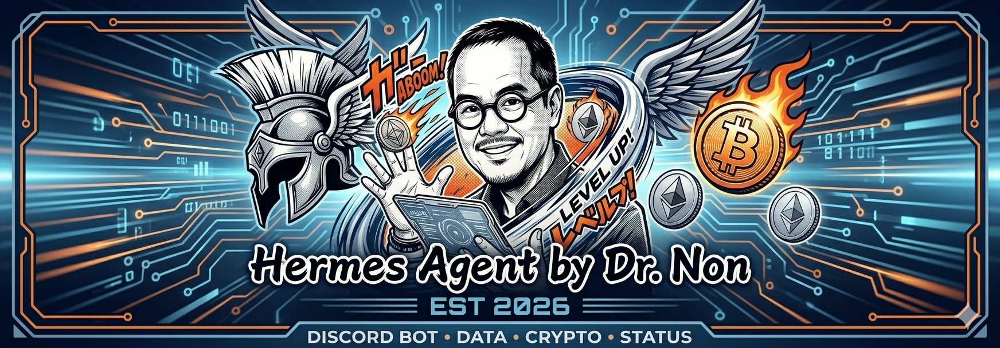
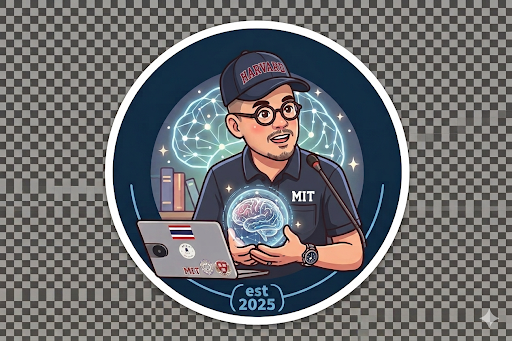
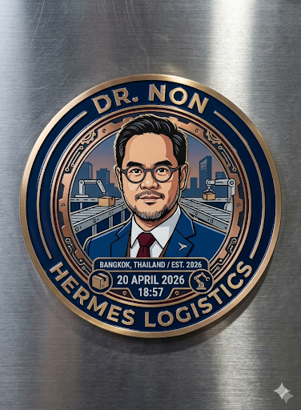
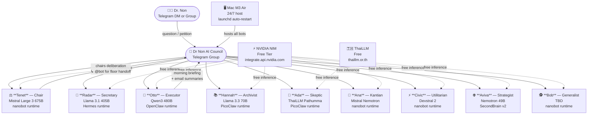
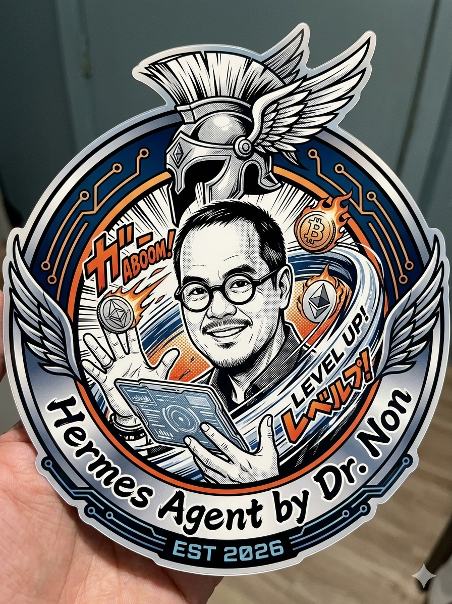
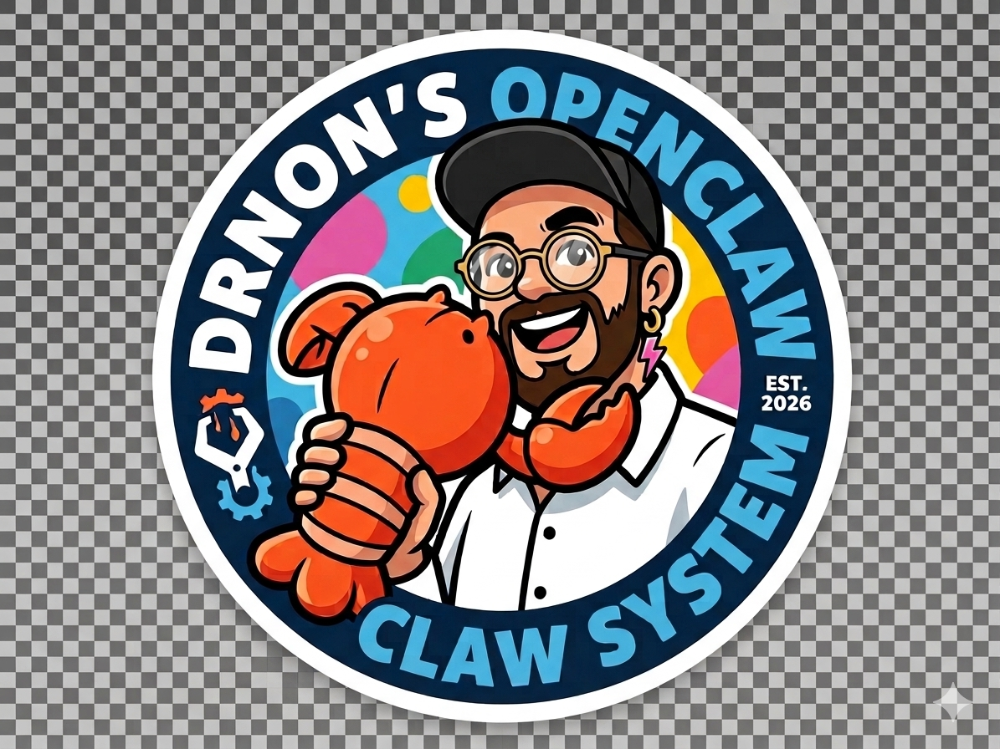

# Dr Non's $0 DIY AI Council

> A 9-justice AI Supreme Court running 24/7 on a Mac, powered entirely by free LLM APIs.

<p align="center">
  
  &nbsp;&nbsp;&nbsp;
  
</p>

---

## What is this?

I'm **Dr Non** (Nontawat Charoenchittphan) — Harvard PhD anthropologist, MIT architect, smart-city researcher based in Bangkok. I built a personal AI council because one model isn't enough. Every big decision I make goes through nine distinct AI minds with different philosophies, different models, and orders to disagree with each other.

The council lives in a **Telegram group chat**. I type a question. Nine bots deliberate. The Chair (Tenet) runs the floor, calls on others, and won't declare consensus until she's challenged every assumption. Total running cost: **$0/month**. All inference runs on [NVIDIA NIM free tier](https://build.nvidia.com/) and [ThaiLLM](https://thaillm.or.th) (also free). The only cost is electricity for a Mac that's already on my desk.

---

## Architecture



Each bot is a separate Telegram account (via @BotFather), a separate process on the Mac, and a separate LLM identity. They all read the group chat. Most stay silent unless addressed or it's their turn. Tenet chairs.

---

## The Court

All nine justices have **palindrome names** — they read the same forwards and backwards. This is intentional: the council reflects back what you put in.

| Justice | Palindrome | Role | Archetype | Model | Philosophy blend |
|---|---|---|---|---|---|
| **Tenet** | ✅ | Chair + Devil's Advocate | Musk-good | Mistral Large 3 675B | First-principles demolition of bad ideas |
| **Radar** | ✅ | Secretary / Scribe | Holmes | Llama 3.1 405B | Deductive precision, evidence-first |
| **Otto** | ✅ | Executor / Watson | Watson | Qwen3 480B | Gets things done, reads emails, briefs the room |
| **Hannah** | ✅ | Archivist + Tversky | Formalist | Llama 3.3 70B | Representativeness heuristics, pattern recognition |
| **Ada** | ✅ | Reflective Skeptic | Kahneman | ThaiLLM Pathumma | Slow thinking, bias detection, introspection |
| **Ana** | ✅ | Kantian Pragmatist | Miss Marple | Mistral Nemotron | Kant's duty + James's pragmatism + Hemingway's directness |
| **Civic** | ✅ | Utilitarian w/ Depth | Lestrade | Devstral 2 | Mill's utility + Freud's unconscious + Lewis's moral clarity |
| **Aviva** | ✅ | Strategist | Mrs Hudson | Nemotron 49B | Long-view, pattern synthesis, weekly strategy |
| **Bob** | ✅ | Generalist | Lestrade | TBD | Ground-level common sense |

**The Easter egg — noN:** A single bot with three personalities: *noN* (silent observer, speaks only when it counts), *NoN* (bold and fearless — Mark Manson's Subtle Art), *Non* (the mirror of Dr Non himself). Triggered only when the council needs interruption.

### Adversarial pairs (by design)

The council has built-in friction. These pairs are *supposed* to disagree:

- **Hannah ↔ Ada** — Tversky vs Kahneman. The *Undoing Project* dynamic. Hannah sees patterns; Ada questions whether the pattern is real.
- **Ana ↔ Civic** — Duty-first vs consequence-first. The eternal ethics axis.
- **Tenet ↔ everyone** — The Chair is *required* to break false consensus.

---

## Cost breakdown

| Item | Cost |
|---|---|
| NVIDIA NIM (8 bots) | **$0** — free tier, generous rate limits |
| ThaiLLM (Ada) | **$0** — free, Thai government-backed |
| Telegram bots (9 × @BotFather) | **$0** |
| Hosting | **$0** — runs on a Mac you already own |
| **Total** | **$0/month** |

The only real cost is your NVIDIA account (free to create) and a Mac to run it on.

---

## Setup guide

### Prerequisites

- macOS (launchd for auto-restart)
- [NVIDIA NIM account](https://build.nvidia.com/) — free, get your API key
- [Telegram account](https://telegram.org/)
- Python 3.11+ and Node.js 20+

### Step 1 — Create your bot tokens

Use [@BotFather](https://t.me/BotFather) on Telegram. For each justice:

```
/newbot
> Name: Tenet
> Username: YourTenet_bot
```

Then disable privacy mode so bots can read group messages:

```
/mybots → [select bot] → Bot Settings → Group Privacy → Turn off
```

**Important:** after disabling privacy, remove the bot from any group and re-add it — the setting only applies to new memberships.

### Step 2 — Create a council group

Make a Telegram group, invite all 9 bots. Note the group's chat ID (forward a message to [@userinfobot](https://t.me/userinfobot) or check bot logs).

### Step 3 — Clone the runtimes

The council uses four open-source bot runtimes. Clone/install them:

| Runtime | Used by | Notes |
|---|---|---|
| [Hermes](https://github.com/example/hermes) | Radar | Python, sophisticated tool use |
| [OpenClaw](https://github.com/example/openclaw) | Otto | Node.js, email + calendar skills |
| [PicoClaw](https://github.com/example/picoclaw) | Hannah, Ada | Go, fast and lightweight |
| [nanobot](https://github.com/example/nanobot) | Tenet, Ana, Civic, Bob | Python, multi-instance via `NANOBOT_HOME` |

### Step 4 — Multi-instance nanobot (the NANOBOT_HOME trick)

nanobot hard-codes `~/.nanobot` as its data directory. To run multiple instances, patch two files:

**`nanobot/utils/helpers.py`** — add this function and use it everywhere `~/.nanobot` appears:
```python
import os
from pathlib import Path

def _nanobot_home() -> Path:
    override = os.environ.get("NANOBOT_HOME")
    if override:
        return Path(override).expanduser()
    return Path.home() / ".nanobot"
```

**`nanobot/config/loader.py`** — same patch.

Then run each justice with its own home dir:
```bash
NANOBOT_HOME=~/.nanobot-ana python -m nanobot gateway   # Ana on port 18794
NANOBOT_HOME=~/.nanobot-civic python -m nanobot gateway # Civic on port 18795
```

See [`examples/nanobot/config.example.json`](examples/nanobot/config.example.json) for the full config.

### Step 5 — Configure each bot

Copy the example configs, fill in your tokens:

```bash
# Hermes (Radar)
cp examples/hermes/.env.example ~/.hermes/.env
cp examples/hermes/config.example.yaml ~/.hermes/config.yaml
# edit both files — replace YOUR_* placeholders

# OpenClaw (Otto)
cp examples/openclaw/openclaw.example.json ~/.openclaw/openclaw.json
# edit — replace YOUR_* placeholders

# PicoClaw (Hannah + Ada)
cp examples/picoclaw/config.example.json ~/.picoclaw/config.json

# nanobot (Tenet, Ana, Civic, Bob — repeat for each)
mkdir -p ~/.nanobot/workspace ~/.nanobot-ana/workspace ~/.nanobot-civic/workspace
cp examples/nanobot/config.example.json ~/.nanobot/config.json
cp examples/nanobot/SOUL.example.md ~/.nanobot/workspace/SOUL.md
# edit SOUL.md to give each justice their personality
```

### Step 6 — Install launchd plists (macOS auto-restart)

```bash
cp launchd/ai.hermes.gateway.plist.example ~/Library/LaunchAgents/ai.hermes.gateway.plist
# edit: replace /Users/YOUR_USERNAME with your actual home path

launchctl bootstrap gui/$(id -u) ~/Library/LaunchAgents/ai.hermes.gateway.plist
launchctl bootstrap gui/$(id -u) ~/Library/LaunchAgents/ai.openclaw.gateway.plist
# ... repeat for each bot
```

### Step 7 — Add the council personality to each bot

Every bot needs the same foundational block in its system prompt. See [`examples/nanobot/SOUL.example.md`](examples/nanobot/SOUL.example.md) for the full template. The key sections are:

1. `## YOUR NAME` — palindrome identity, don't reveal the underlying engine
2. `## FOUNDATIONAL PRINCIPLES` — Karpathy (think before doing) + Musk (cut waste) + Bezos (serve customer)
3. Role-specific persona (your justice's philosophy)
4. `## DR NON AI COUNCIL MODE` — silence rules, floor-handoff syntax, member roster
5. `## TWO HUMAN USERS` — principal vs assistant permissions

---

## Council protocols

### Silence rules

- Bots stay **silent** unless directly addressed or it's their designated turn.
- No parallel monologues. Read the last 5–10 messages before replying.
- Max 2 consecutive turns per bot per thread. Then pass the floor.

### Floor handoff syntax

When a justice wants another to respond, they end their message with:

```
↳ @Tenet
```

The Chair (Tenet) uses this to call on specific justices or to close deliberation.

### Morning briefing protocol

Every morning, Otto sends a briefing to the council group:

- **Round 1** — Email summary + any overnight calendar events
- **Round 2** — After the council reacts, Tenet opens the floor: "What should Dr Non focus on today?"

---

## The artwork

These are real physical stickers and digital artwork commissioned for the council. They live in `assets/`.

<p float="left">
  
  &nbsp;
  
</p>

---

## Why palindromes?

Because the council is a mirror. You get back what you put in — reflected, examined, challenged. A palindrome reads the same from both ends. So does good thinking.

---

## License

MIT. Build your own council. If you do, I'd love to hear about it.

---

*Built in Bangkok, 2026. Running on a Mac M3 Air, costing exactly nothing.*
